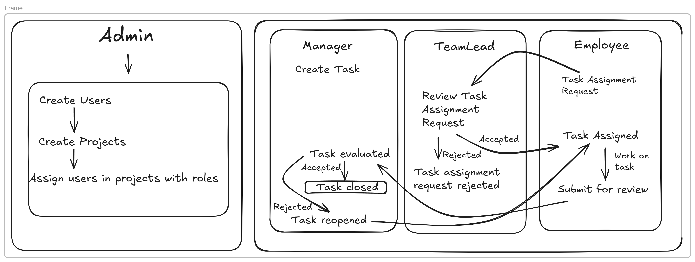
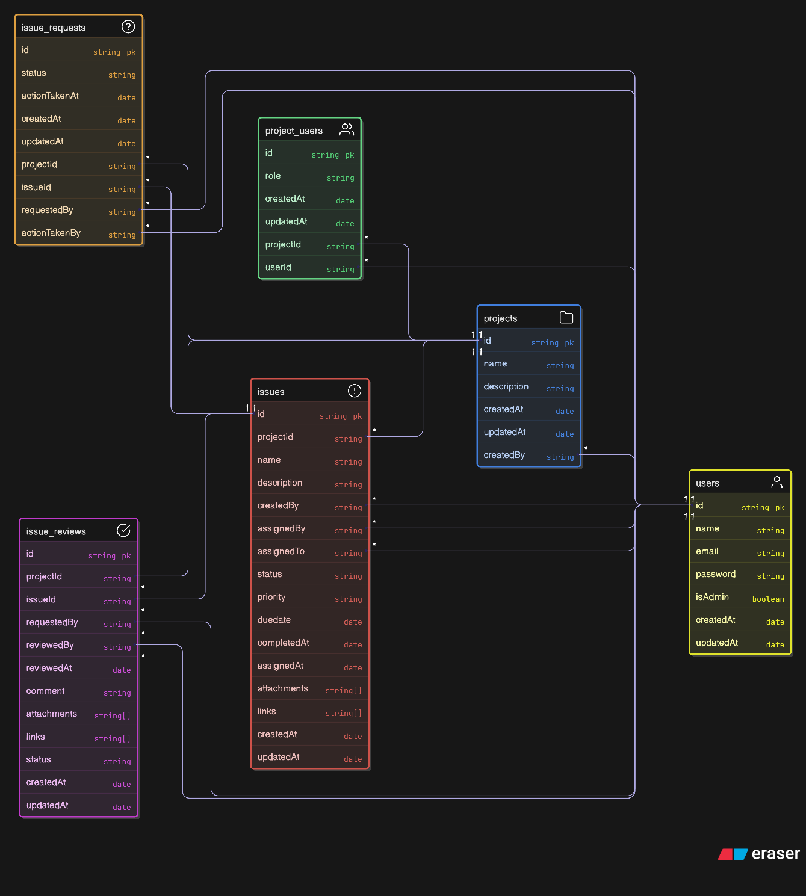
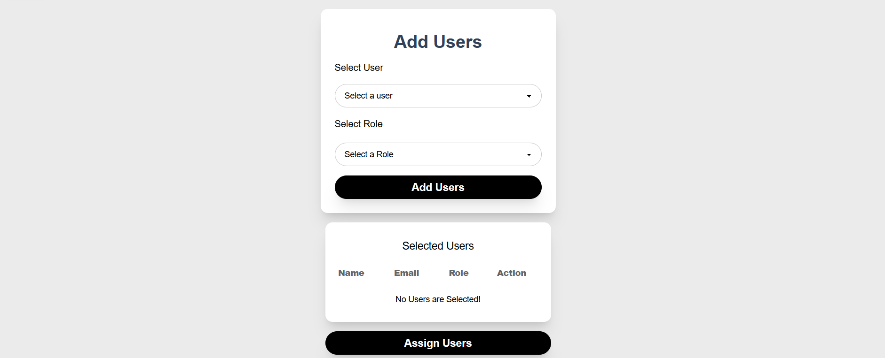
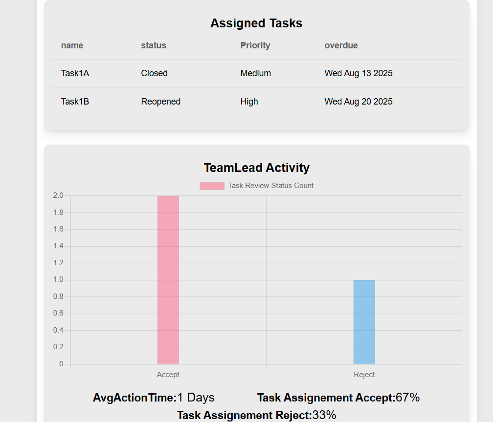
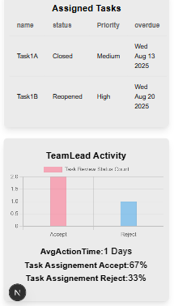
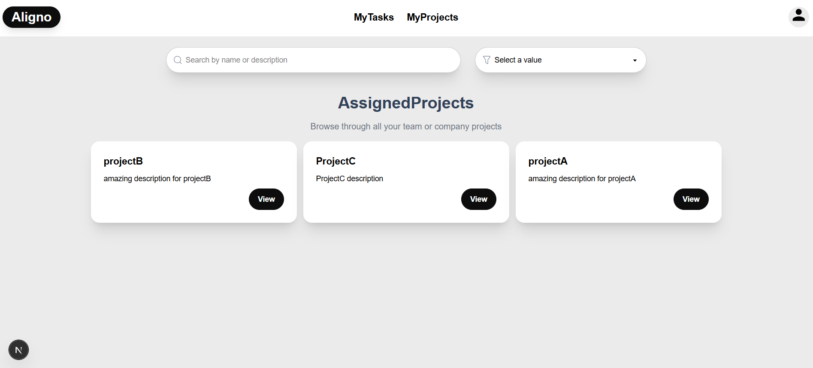
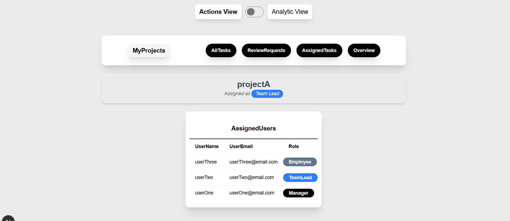
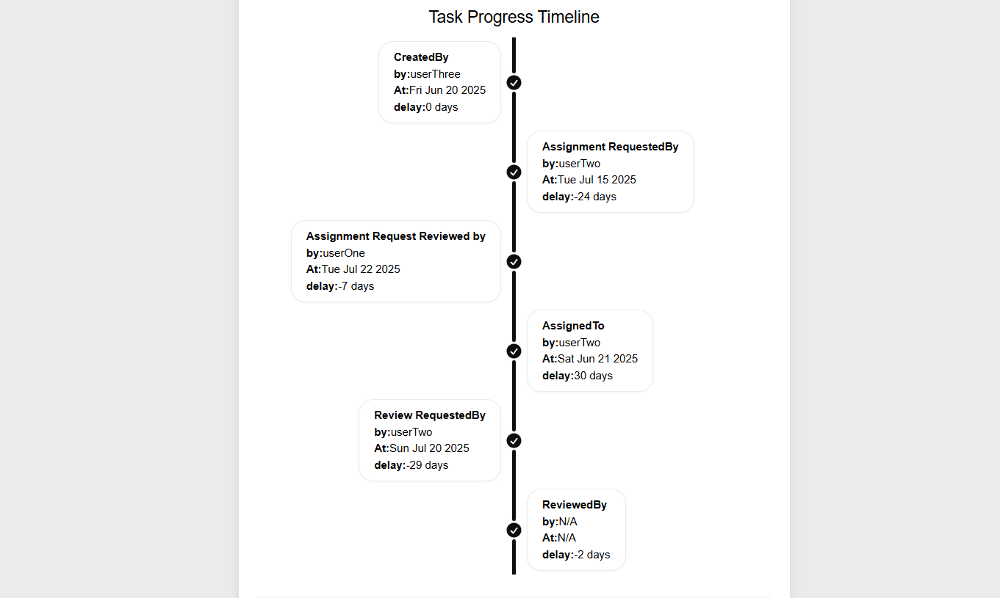
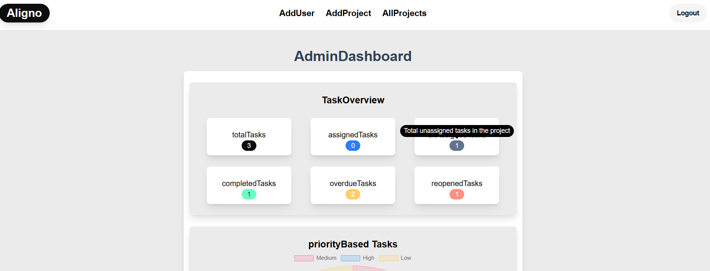
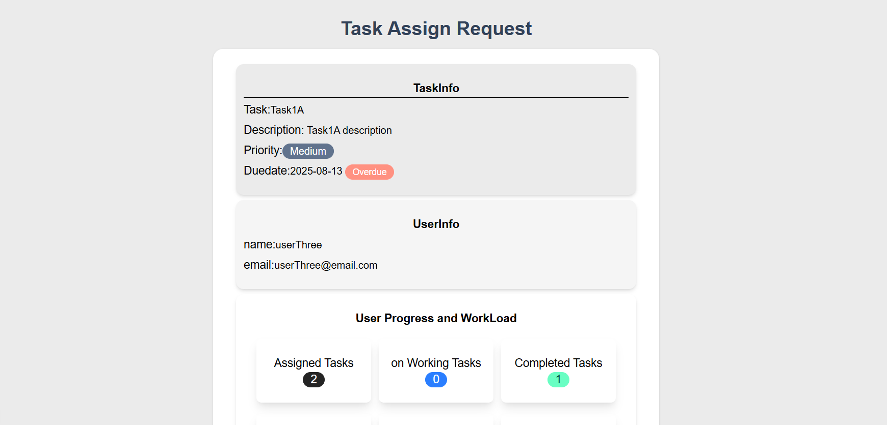

# Aligno
“Aligno – Role-based workflow management made simple for modern teams”

### Summary
Aligno is designed to streamline workflow management in small to mid-sized teams. Every project in Aligno comes with role-specific access, ensuring structured collaboration between Admins, Managers, Team Leads, and Employees.
The system covers the entire task lifecycle — from task assignment requests to approvals and closures — while keeping everyone updated with email notifications and project-wide insights.
Aligno covers the full task cycle with dashboards and analytics for better visibility.

### Tech Stack
- Frontend: React
- Backend: Node.js 
- Framework: Next.js (App Router) (Full-stack: frontend + backend APIs)
- Styling: Tailwind CSS
- Database: MongoDB + Mongoose
- Authentication: JWT-based + Project-specific - - Role-based Access Control
- Notifications: Resend

### Features in v1
- Project-Specific Roles
Admin, Manager, Team Lead, Employee
- Role-Based Dashboards
- Unique dashboards for each role with tailored navigation
- Task Management Cycle
- Request → Approve → Assign → Work → Closure
- Analytics & Graphs
- Workload distribution, efficiency tracking, and project progress
- Deployed on Vercel for scalability and simplicity

### Work in Progress / Coming Soon (v2)
- Reminders (due dates & follow-ups)
- File Attachments & Links
- In-app Notifications (real-time alerts inside dashboard) , Email Notifications
- Team Chat (communication between members assigned to the same project)
- Advanced Reporting & Export Options
- AI-Powered Insights (task optimization, workload balancing)

### Getting Started
1. Clone the repository
- git clone ```https://github.com/shiv-sk/aligno```
- cd aligno

### Installation
- npm install

### Setup environment variables
- MONGODB_URI=Mongodb url
- JWT_SECRET=JWT token secret
- JWT_EXIPRY=JWT token expiry
- RESEND_API_KEY=Resend api key

### Run the app locally
- npm run dev
- http://localhost:3000

### Demo credentials
- Admin:
email - admin@email.com
password - admin123
- Userone:
email - userOne@email.com
password - 123456
- Usertwo:
email - userTwo@email.com
password - 123456
- userThree:
email - userThree@email.com
password - 123456

### Project Status
- v1 (Complete) → Core features: project-specific roles, dashboards, task lifecycle, analytics.
- Currently Working On → Reminders , Email notifications & polishing the UI.
- v2 (Planned) → Reminders, file system, in-app notifications, team chat, reports, and AI-powered insights.

### Feedback & Contributions
- I’d love to hear your thoughts!
- Have suggestions to improve Aligno?
- Want to collaborate or contribute?
- Found a bug or have a feature request?
- Feel free to reach out

### Contact
- You can connect with me here:
- discord: shivanandkhudanapur_40149, 
- reddit: https://www.reddit.com/user/Material_Rub8407 
- email: shivanandcrew034@gmail.com
- linkedIn: https://www.linkedin.com/in/shivanand-khudanapur-a809a8274
- x: https://x.com/YkShivanand

### Architecture
- Flow-chart

- Data modeling

### Screenshots









### Demo
[Click here to see demo](https://vimeo.com/1122580952?share=copy)

### Live
[Click here to view Aligno](https://aligno-green.vercel.app)